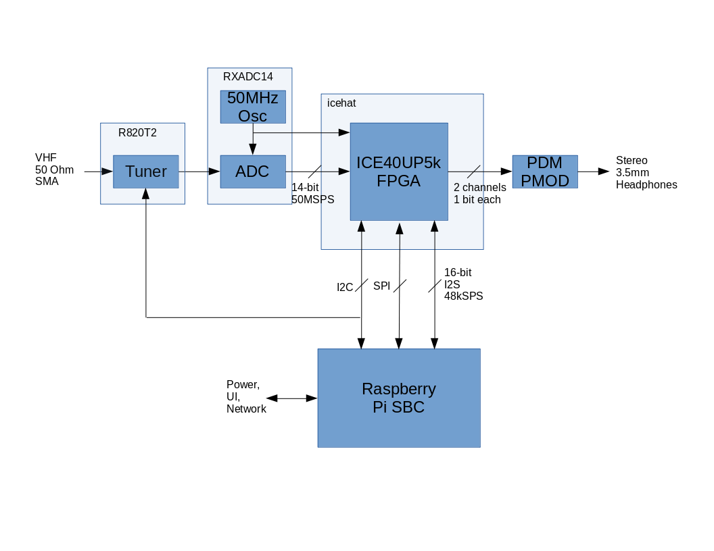

# rpi_rxadc
An SDR for Raspberry Pi

## What is it?
This is a project to explore the feasibility of using an off-the shelf
Raspberry Pi single-board computer (SBC) as the basis for an FPGA-based
Software Defined Radio (SDR) system. The goal is to eventually build a single
add-on "Hat" for the Raspberry Pi that would provide wide-band receive
capability with a reasonable feature set and good sensitivity.

## System Architecture
The system architecture is shown in the diagram below

If VHF operation is desired, 50-ohm VHF RF input from an antenna arrives at
the R820T2 breakout board where it is downconverted to a 5MHz IF, otherwise
for HF operation a 0-20MHz signal is driven into the RXADC_14 board where it
is digitized and passes to the icehat FPGA board. In the FPGA, the HF or VHF
IF signal is tuned to baseband and then filtered and decimated with CIC and
FIR filters. The final sampling rate is selectable - either 88.2kHz, 48kHz or
44.1kHz.

By default the tuned, filtered and decimated I & Q signals are output through
a pulse-density modulator (PDM) to yield a 1-bit digital signal that can be
converted to analog by means of a simple 1-pole low-pass filter. Alternatively,
the PCM I & Q signals can be transmitted to the Raspberry Pi host computer via
the I2S port, processed through user-determined demodulation algorithms and if
desired sent back to the FPGA over the I2S bus and the final demodulated audio
output to analog by the PDM conversion.

At power-up the FPGA is unconfigured and in a quiescent state. The Raspberry Pi
loads the gateware bitstream into the FPGA over the SPI bus, using several GPIO
pins to manage the process (reset, configuration selection and status). Once
the gateware is running, the host may use the same SPI port to communicate
with it, checking ID and status, as well as managing the internal settings such
as tuning frequency, output muxing, etc.

The I2S and I2C interfaces between the FPGA and Raspberry Pi emulate a commonly
use WM8731 audio codec, including many of the internal write-only registers that
control such things as sample rate, sub-function power control and audio output
volume. This "masquerade" is required to allow the use of standard Linux audio
drivers that are already set up for the WM8731 codec. Faking a standard codec
protocol greatly simplifies the host-side software development effort.

## Hardware
Read more about the hardware here:
https://github.com/emeb/rpi_rxadc/hardware/README.md

## Gateware
Read more about the FPGA design (gateware) here:
https://github.com/emeb/rpi_rxadc/gateware/README.md

## Software
Read more about the software design (gateware) here:
https://github.com/emeb/rpi_rxadc/software/README.md

